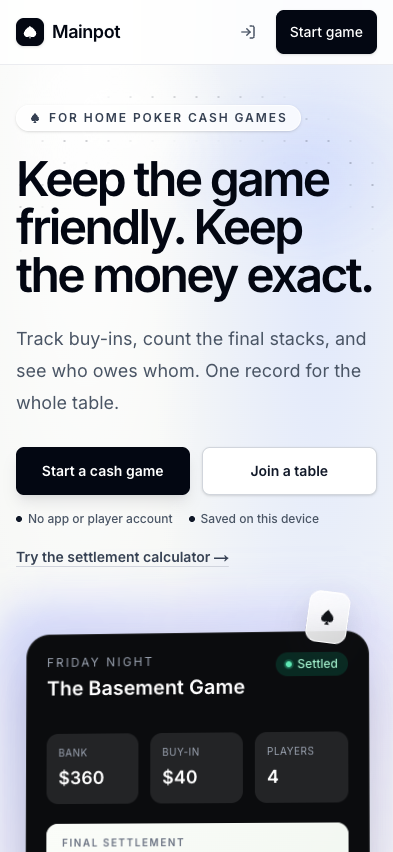
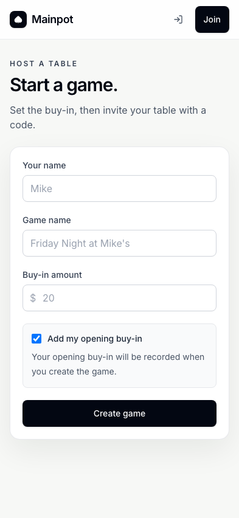
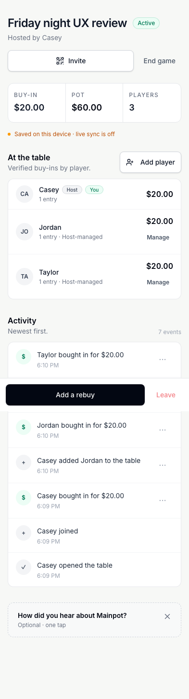
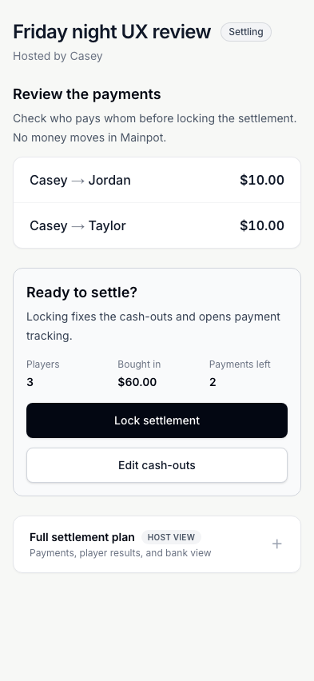
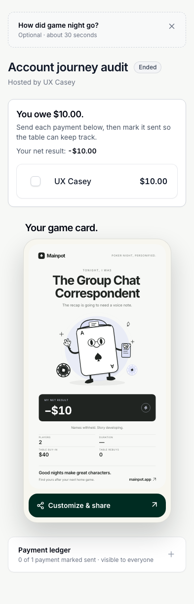
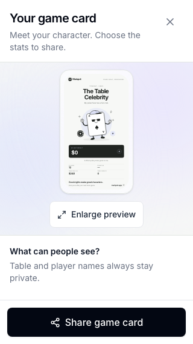
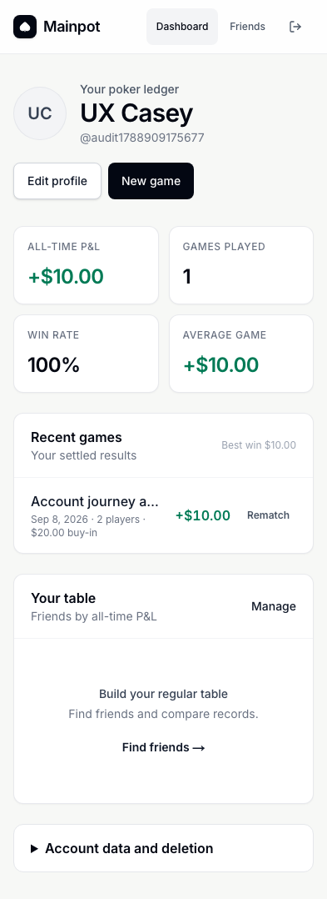

# Mainpot: whole-app review and UI/UX case study

**Reviewed September 8, 2026 · Current local working tree · Independent browser contexts · Synthetic data**

Mainpot's core game-night journey works well: create a table, record purchases, reconcile stacks, review payments, lock settlement, and track what has been sent. Its strongest product decisions are guest access, explicit host controls, visible reconciliation, and personal payment instructions. The visual system is restrained and coherent, and the app remains usable at a 320-pixel viewport.

The most consequential weaknesses are in trust and continuity. This review reproduced a signed-in host getting stuck when switching browsers, a cross-game audit-history write, and a sender accepting their own friend request, and a saved-friend game invitation disappearing from the recipient dashboard. Money-input edge cases and several accessibility problems also need attention. These deserve priority over another visual redesign.

This is an expert evaluation supported by executed tests and inspected screenshots. It is not a study with recruited users, an exhaustive security assessment, or proof of the deployed production system. Proposed behavioral effects and research targets below are hypotheses, not measured conversion or satisfaction results.

## 1. Decision summary

**Recommendation: address the four high-priority defects before expanding use, then repair money validation and accessibility. Preserve the main game and settlement structure.**

| Priority | Finding | Evidence | Recommended action |
| --- | --- | --- | --- |
| P1 | A signed-in host cannot resume a game in a second browser | Reproduced through the UI | Resolve the current seat by authenticated account as well as browser session |
| P1 | A user can append an audit event to another synthetic game | Reproduced through the authenticated API | Bind event actors to the event's game and generate authoritative events with the mutation |
| P1 | A sender can accept their own friendship request | Reproduced through the authenticated API | Restrict acceptance to the recipient and protect relationship endpoints |
| P1 | Saved-friend game invitations do not appear for the recipient | UI and API reproduction | Return invitation metadata through an invitee-scoped read |
| P2 | History cannot reopen the original settlement | Observed UI | Add an accessible link to the original game record |
| P2 | Negative calculator input becomes zero while results say balanced | Reproduced through the UI | Validate all fields before displaying a usable payment plan |
| P2 | A sub-cent opening buy-in becomes a $0.00 local entry | Reproduced through the UI | Validate the rounded amount and supported precision consistently |
| P2 | Supporting text and the Venmo action fail contrast checks | Automated checks plus visual inspection | Correct semantic color tokens across light and dark surfaces |
| P2 | Payment shortcuts look like static payment rows | Observed UI; discoverability impact is a hypothesis | Add an explicit payment-details cue and accessible action name |
| P2 | Incoming-payment labels truncate on mobile | Observed at 393 pixels | Show the payer first and omit the redundant recipient in personal views |
| P2 | Deletion requests have no durable visible pending state | UI and database reproduction | Show requested date, status, and support expectations after reload |
| P2 | The self-host command block is not keyboard-focusable when it scrolls | Accessibility scan | Make the code region keyboard reachable and label it |
| P3 | Calculator entry starts too far down its mobile landing page | Observed layout | Reduce repeated introductory content above the worksheet |
| P3 | Recap privacy controls fall below the first small-screen viewport | Observed at 320 x 568 | Surface a compact privacy summary beside the share action |

There is also a **local magic-link integration failure** in the audit environment. It is reported separately in Section 9 because hostname handling limits how confidently it can be attributed to the deployed app.

## 2. Review scope and evidence quality

### The version actually reviewed

The repository was `/Users/anurag/Documents/ChatGPT/Mainpot`, based on commit `35e2affaee60b09548cde1bcc9415f7511d4ad9b`, with existing uncommitted changes. Those changes included optional host opening buy-in, installation UI, settlement presentation and payment-state updates, and related tests/migrations. The report therefore describes the **working tree**, not just that commit or the current production deployment.

Application source was not edited, committed, pushed, or deployed by this review. A source hash snapshot and starting diff inventory are included with the evidence. Initial and final source hashes were compared to identify concurrent drift.

### Environments

- **Browser-only ledger:** production build served at `http://127.0.0.1:3100`, with the public Supabase configuration explicitly empty at build time.
- **Shared game:** separate production build served at `http://127.0.0.1:3110`, backed by a disposable Supabase project on port `55321` with the current migration chain applied.
- **Runtime:** OrbStack was verified as the active Docker context and engine before starting the disposable database.
- **Browser engines:** the repository suites exercised Chromium and WebKit. Mobile projects emulated Pixel 5 and iPhone 13. Additional visual review used 393 x 852, 1440 x 900, and 320 x 568 viewports.
- **Data:** all new games, people, profiles, payment handles, exports, friend requests, and email messages were synthetic. No external payment was sent.

Separate browser contexts establish separate browser identities and exercise real local realtime behavior. They do not reproduce physical radios, an iOS software keyboard, installed-PWA lifecycle, or app-to-app payment handoff.

### Methods

The work combined a route and state inventory, source review, the existing test suites, additional browser journeys, local API probes, accessibility scans, and screenshot inspection. Two bounded read-only source reviews were independently checked against the complete migration chain and live probes. Preliminary concerns that were contradicted by later migrations were excluded.

The heuristic review considers system feedback, understandable language, prevention and recovery of errors, discoverability, consistency, and cognitive load. These categories follow the [Nielsen Norman Group usability heuristics](https://www.nngroup.com/articles/ten-usability-heuristics/). Accessibility checks used axe-core 4.13 with WCAG 2 A/AA, 2.1 AA, and 2.2 AA tags. Interpretation was checked against the [W3C WCAG quick reference](https://www.w3.org/WAI/WCAG22/quickref/).

A zero-violation scan does not establish WCAG conformance. Contrast checks, keyboard walkthroughs, viewport tests, and native assistive-technology testing cover different things. Raw DOM target dimensions were treated only as screening data: a small checkbox may have an adequately sized associated label, and inline links can qualify for target-size exceptions.

## 3. Executed test results

| Layer | Executed check | Result | What it establishes |
| --- | --- | --- | --- |
| Unit logic | `npm test` | **105 passed in 19 files** | Existing settlement, formatting, input, recap, account/API and supporting logic assertions |
| Static quality | `npm run lint` | **Passed** | Existing application passed lint before audit scripts were added |
| Production compilation | `npm run build` | **Passed** | Current app and service worker compile successfully |
| Shared browser flows | `npm run test:e2e:realtime -- --workers=2` | **13 passed**; suite ran with one worker | Real local Supabase, independent identities and current migrations |
| Desktop browser-only flows | `npm run test:e2e -- --workers=2` against port 3100 | **13 passed** | Browser-only create, roster, settlement, recap, validation and recovery flows |
| Mobile browser-only flows | `npm run test:e2e:mobile -- --workers=2` | **26 passed** | Same smoke coverage in emulated mobile Chromium and WebKit |
| Database assurance | `npm run test:db:assurance` against disposable stack | **Passed** | Role restrictions, retry safety, cross-game guards and payment-write conditions covered by this script |
| Database churn | `SOAK_DURATION_MS=60000 npm run test:db:soak` | **31 complete assurance cycles passed** | A short repeated local assurance run; not a sustained-load benchmark |
| Additional visual/accessibility review | Public and game states plus account states | **60 scanned screen states** | Actual rendered states, DOM overflow and automated accessibility evidence |
| Additional account flow | Sign-up, sign-in, profile validation/save/reload, export, game history | **Passed** | Local password-account journey with email confirmation disabled |
| Social flow | Friend requests, templates, rematch and game invitations | **Intended relationship flow passed; invitation display defect found** | Normal relationship actions plus returning-organizer setup |
| Negative account/API probes | Contact read, sender self-accept, cross-game audit insert | **One protection confirmed; two defects reproduced** | Tested behavior beyond what the normal UI exposes |
| Edge flows | 12-player disclosure, negative calculator, sub-cent create, private PNG export | **Two defects; disclosure/export passed** | Validation boundaries, full roster access and export output |
| PWA | Service-worker control, offline navigation, reconnect | **Passed** | Branded offline shell and successful subsequent online navigation |

**52 existing browser tests passed in total.** This count excludes additional exploratory journeys and the 60 screen-state scans; those are not 60 independent end-to-end tests.

The realtime suite covered guest access gating, independent entries, host approval, duplicate opening-buy-in prevention, rebuys, early cash-out locking, host transfer, offline/reconnect, audit presentation, reconciliation, finalized payments, host-managed seats, and role-specific controls. The database script additionally checked anonymous-auth rotation, cross-game writes, draft-payment rejection, idempotency, and private push subscription access.

Exploratory harnesses were adjusted when selectors used old copy, reduced-motion mode skipped the reveal stage, or a test attempted a thirteenth seat beyond the local 12-player cap. Those harness mismatches were not counted as app defects. Final evidence files retain the completed runs; the known magic-link failure remains explicitly unresolved.

## 4. Product case study: the job Mainpot is doing

### The real user problem

The host is trying to preserve agreement about money while also running a social evening. A player wants to know that their buy-ins were recorded and, later, exactly what action settles their obligation. The product succeeds when those questions can be answered quickly without interrupting play or making participants reconstruct the ledger from chat messages.

Three useful evaluation personas emerge from the app's behavior. These are analytical personas, not interviewed people:

1. **The playing host:** creates the table, buys in, approves entries, resolves mismatches, locks settlement and follows unpaid transfers.
2. **The guest player:** joins without an account, records their own activity, checks their stack, and pays the right person.
3. **The returning organizer:** expects identity, history, contacts and recurring setup to persist across devices and games.

The first two journeys are considerably stronger than the third. Core gameplay has explicit phases and guardrails. Account continuity currently breaks at a moment when the user reasonably expects the app to recognize them.

### Journey map

| Stage | User question | Current experience | Assessment |
| --- | --- | --- | --- |
| Discover | Is this for my home game? | Direct promise, cash-game context, create/join choices, calculator link | Clear and credible |
| Create | What must I set up? | Three main fields and explicit opening-buy-in choice | Low friction; monetary edge validation needs work |
| Join | Is this the right room? | Host, game, buy-in and code shown before joining | Good orientation |
| Play | Did my money get recorded? | Roster, verified totals, pending approval, activity and fixed actions | Strong hierarchy; supporting text is too faint |
| Cash out | What number should I enter? | Final-stack explanation, saved state and reconciliation | Good distinction between stack and profit |
| Review | Who will pay whom? | Payment preview precedes locking; editing remains available | One of the app's strongest steps |
| Settle | What do I personally need to do? | Owe/receive/even headline, personal transfers and marked-sent progress | Clear intent; payment shortcuts need a visible cue |
| Share | What will other people see? | Character card, privacy controls and PNG/native-share handling | Distinctive reward; small-screen privacy summary could improve |
| Return | Can I use another device or find the result? | Account history works, but the same seat is not recognized in another browser | Major continuity defect |

### The central design opportunity

Treat reliable identity, money validation, and trustworthy state as part of the user experience. A pleasing payment card does not repair a lost host identity or an untrustworthy activity history. Conversely, the app does not need to expose database concepts to solve these problems. Users should simply see the right room, accurate amounts, clear progress, and honest recovery messages.

## 5. Screen-by-screen UI/UX assessment

### Landing page

The headline makes both the social and accounting value clear. “Start a cash game” and “Join a table” are distinct, visible options. The mobile screenshot puts both actions within the first screen. The calculator link offers a lower-commitment route, while local mode correctly says data is saved on the current device.

The pale backdrop, dark primary buttons, generous spacing and restrained suit graphics provide a recognizable identity without competing with the proposition. The footer and self-hosting content support the open-source positioning.

The navigation's icon-only sign-in action is less discoverable than the prominent game CTA. That is a reasonable guest-first tradeoff, but returning users should be studied separately. Do not solve this by forcing accounts into the game-creation path.

### Create and join

The three-field create form is appropriately short. Showing the consequence of “Add my opening buy-in” reduces the risk of accidentally recording money for a non-playing organizer. Validation moves focus to the first invalid field; the 320-pixel error-state capture remained within the page width.

Join supports both a code and a pasted invite URL. The invitation dialog names the host and amount before participation. A guest joins at zero and chooses to record the opening buy-in explicitly; the host then approves it. This is a useful separation of membership from money.

Weaknesses are the sub-cent input hole, low-contrast code guidance, and the inability of an already signed-in person to reclaim their seat in a second browser. A successful “Joined!” toast followed by the same disabled join interface is particularly confusing because the feedback contradicts the available action.

### Active game: host and player

The structure is easy to understand: game identity, invite/end controls, totals, roster, activity, then optional feedback. The persistent bottom action makes common purchases accessible. Host-managed players have visible management controls, while guests do not receive those controls.

The roster is primary information and remains in normal document flow. At 320 pixels, a 12-seat table initially showed ten rows, expanded to twelve, and collapsed to ten again without horizontal document overflow. This is preferable to hiding important game state inside a second scroll area.

Activity timestamps, counts and overflow actions are too faint. Repeated generic “Table updated” messages can also accumulate during rapid operations. The automation generated updates faster than typical human input, so the frequency observed should not be treated as a measured real-world annoyance. A useful follow-up is to coalesce identical notices and reserve interruptions for actions requiring attention.

The desktop game remains a relatively narrow single column. That preserves continuity with mobile, though it leaves substantial horizontal space at 1440 pixels. This is not inherently a defect. A host-only two-column experiment could place activity beside the roster at wide widths, but should be tested before changing the current order.

### Cash-outs and discrepancy resolution

“Final chip values, not profit” is excellent domain guidance. Per-row save state, the total bank, entered cash-outs and a visible discrepancy support a host who is reconciling under social pressure. The shared guest flow exposes the current player's editable field while showing the rest of the table as read-only.

A $10 mismatch in the review generated an explicit resolution action instead of quietly producing a final payment plan. The repository suites also exercised discrepancy allocation. The report does not claim that every combination of allocation weights and roster values was manually explored; those combinations rely on the unit/database coverage and source review.

There is an architectural reliability concern worth follow-up: some lifecycle and cash-out mutations write the data first and append an audit event afterward. If the second operation fails, the first can remain committed while the caller sees a failure. That ordering is source-confirmed in `lib/data.ts`, but the specific network/event-cap failure was not reproduced through the browser in this review. It should become a fault-injection test, not be described as a frequently observed user failure.

### Review and lock

The payment preview is visible before the irreversible decision. It names who pays whom, states that Mainpot does not move money, and explains that locking fixes cash-outs and opens payment tracking. “Edit cash-outs” remains easy to find. The final confirmation adds a deliberate pause.

This flow deserves preservation. It makes the host review an understandable financial decision instead of a generic “finish” action. Keep the preview visible even if future designs compact the rest of the page.

### Finalized settlement and payment completion

The personal result leads with the action: how much remains to send or receive. Partial and completed states were tested: $20 owed became $10 after the first mark, then “All your payments are marked sent,” and reopening restored the remaining amount. The final net result remains separate from payment progress. Shared host/player views updated correctly.

The distinction between **marked sent** and **received** is especially good. The receiver is told to confirm receipt in their payment app or cash. The neutral checkmark and strike-through also keep completion visually calm.

Two details reduce usability. First, a row with payment shortcuts looks almost the same as a static row. Tapping the recipient/amount opens Venmo and Zelle details, but the screen offers no obvious instruction or chevron. Second, incoming transfers repeat the current recipient's name and truncate at phone widths. Personal incoming rows should emphasize who is paying the user.

The payment ledger is explicitly labeled visible to everyone. The full host plan is separately labeled as host view. This is a shared-ledger product; the narrower player presentation should not be confused with a promise that participants cannot inspect the shared underlying ledger.

### Recap and sharing

The character card adds personality after the money work, with distinct illustrations, a short caption and a clear sharing action. It gives the app a memorable end state rather than leaving users on a bare transaction list.

In the current source, names remain hidden, while dollar amounts and losses are enabled by default. The editor states that table and player names stay private and allows money/stat visibility to be changed. The review disabled amounts and losses, exported a **2160 x 3840 PNG**, and visually confirmed that the amount and identifying names were absent. Reduced-motion mode correctly skipped the animated reveal stage.

At 320 x 568, the first editor viewport contains the title, preview, enlargement action, privacy heading and persistent share button; the actual privacy toggles require scrolling. They are reachable, but the share action is easier to encounter than the settings that define what it shares. A concise “Names hidden · amounts shown” summary near Share would help without adding another confirmation dialog.

### Accounts, dashboard and friends

Password sign-up, password sign-in, profile editing, invalid Zelle feedback, valid-contact persistence and account JSON export all worked in the local shared environment. A finalized signed-in game appeared in Recent games with the expected +$10 result and account statistics. The first-use dashboard gives useful next steps instead of empty charts.

The friend search shows a clear no-results state. A saved game template restored the setup fields, and Rematch prefilled the previous name and buy-in. However, Recent games provides only Rematch: the title does not open the original settlement. Separately, a saved-friend game invitation was stored and marked Invited for the host but did not appear on the recipient dashboard. Two synthetic permanent accounts successfully completed request, recipient acceptance and removal. Sign-out protected the dashboard on revisit. The underlying sender-self-accept authorization flaw remains separate from this successful normal UI flow.

Deletion requests are saved as pending, but the dashboard does not show that durable state after a reload. The unchanged action invites another request and gives the user no way to confirm that the first one is still queued. Also, compact legal/privacy links would be useful at account creation and profile editing, where the user provides personal information.

### Calculator, support and self-hosting

The standalone calculator works as a useful acquisition tool, with a seeded example, clear-example action, player rows, live totals and payment output. The page also contains a substantial worked explanation. At 393 pixels its full height was roughly **10,374 pixels**; the first viewport reaches the worksheet header, with the actual inputs lower down. The jump link helps, but a person arriving specifically to calculate should reach the worksheet sooner.

The negative-value behavior is more important than this layout issue. A visible `-20` field is invalid according to native input validity, yet the output says $0 in, $0 out, balanced, and no payments needed. A live calculator must not allow a final-looking result to coexist with invalid data.

Feedback offers a prominently displayed email address and GitHub alternatives. The review inspected destinations but did not send a real support message. The self-host page provides practical setup commands, but its horizontally scrolling code block lacks keyboard focusability at mobile width. The legal pages rendered and their links were inspected; their legal sufficiency was not assessed.

## 6. Findings with reproduction and acceptance criteria

### F01 · P1 · Cross-browser account continuity fails

**Observed:** browser A signed in, created a game and had host controls. Browser B signed into the same account, opened the game, and was asked to join. Submitting the name showed “Joined!” but left the join form visible and host controls absent.

**Why:** the room resolves `currentPlayer` by `session_id`. The guarded join function recognizes the account's existing row by `user_id` and returns it with the previous session value. The UI and database disagree about how to identify the same person.

**Source:** `app/game/[code]/page.tsx:295`; `supabase/migrations/20260908181344_host_managed_players.sql:385`.

**Fix:** define a single authenticated-seat ownership rule across room rendering and guarded mutations. Preserve anonymous-browser identity as the guest fallback. Avoid solving the UI by granting broader mutation permissions.

**Acceptance:** create as a permanent-account host in A; sign into the same account in B; open the invite and access the same seat and host actions. Verify both contexts remain valid, no duplicate player is created, and anonymous users cannot claim another seat.

**Evidence:** `account-review.json`; `same-account-second-device-after.png`.

### F02 · P1 · Cross-game audit-history insertion

**Observed:** authenticated synthetic user A created one game. User B created a separate game. A inserted a `game_finalized` event addressed to B's game using A's own player ID as actor. The insert succeeded and an independent database read confirmed persistence. No corresponding finalization mutation was required.

**Why:** the event INSERT policy accepts ownership of the actor row without requiring that actor to belong to the event's game. This compromises the reliability of the activity trail; it does not itself demonstrate a change to balances or game status.

**Source:** `supabase/migrations/20260830000000_initial.sql:221`; event display in `components/GameRoom/ActivityFeed.tsx`.

**Fix:** require consistent game membership for actors and subjects, and move authoritative audit-event creation into the same controlled operation as the state mutation. Review which optional analytics/feedback events should remain client-writable.

**Acceptance:** reject cross-game actors and subjects, reject fabricated lifecycle events, and continue to record each valid mutation exactly once, including retries. Test with separate accounts against the final migrated schema.

**Evidence:** `account-probes.json`, `crossGameAuditInsert.allowed=true`, `persisted=true`. This was a local synthetic probe; production exploitation was neither attempted nor inferred.

### F03 · P1 · Friend requests can be self-accepted

**Observed:** user A created a pending request addressed to B, then A updated that same row to `accepted`. The requester's authenticated API call succeeded.

**Why:** the effective UPDATE policy allows either party to update the relationship. The UI's recipient-only button is not a server-side restriction.

**Source:** `supabase/migrations/20260830000000_initial.sql:237`; `lib/friends.ts:92`.

**Fix:** protect the state transition and immutable requester/addressee fields. Only the addressee should accept a pending request; cancellation and removal need their own explicitly allowed transitions. Review insert policy constraints so an already-accepted relationship cannot be supplied at creation.

**Acceptance:** sender self-accept and endpoint rewrites fail; legitimate recipient acceptance, sender cancellation, recipient decline and either-side removal still work.

**Evidence:** `account-probes.json`; normal UI journey in `social-review.json`.

### F13 · P1 · Saved-friend game invitations disappear from the inbox

**Observed:** two accounts became friends. The host created a game, invited the friend and saw “Invited.” The recipient opened Dashboard and had no Join table action. With the recipient's authenticated credentials, a plain invitation query returned one pending row, while the query joined to `games!inner` returned zero rows without an error.

**Why:** the invitation is visible to its recipient, but the game's read policy requires room access. The dashboard's inner join removes the invitation before the person has opened the room code. The UI treats the empty result as “no invitations,” hiding the mismatch.

**Fix:** provide a narrowly scoped invitation lookup that returns only the metadata needed by its actual recipient. Do not solve this by making every game's ledger publicly readable. Define when acceptance grants room access, and handle decline/re-invite consistently.

**Acceptance:** invite a friend who has never opened the room. Their dashboard shows the correct host, game and buy-in and lets them join. Unrelated accounts cannot read the invitation or game. Repeat with an ended game and a declined invitation.

**Source/evidence:** `lib/invites.ts:37`; `supabase/migrations/20260830030000_public_beta_guardrails.sql` game access policies; `social-review.json` records `plainRows=1`, `joinedRows=0`, `visible=false`; `friend-game-invite-mobile.png`.

### F04 · P2 · Invalid calculator input yields a valid-looking result

**Reproduce:** clear the example; enter `-20` in the first Money in field; leave final stacks blank. The field remains `-20` and native validity is false, but totals become zero and the result says “Bank balanced” and “No payments needed.”

**Source:** `components/SettlementCalculator.tsx:40`, where invalid/negative values fall back to zero; live result construction and number inputs in the same file.

**Fix:** retain empty, valid and invalid as distinct states. Show an inline explanation and suppress the payment recommendation until every entered amount is valid. Apply a consistent two-decimal currency policy.

**Acceptance:** negative, non-finite, out-of-range and unsupported-precision values cannot produce a ready-to-use settlement result. Correcting the value clears the error and updates the plan.

**Evidence:** `edge-review.json`, Negative calculator input.

### F05 · P2 · Sub-cent local game creation records zero

**Reproduce:** create a local-mode game with `0.001` as the buy-in. Creation succeeds; the room displays a $0.00 buy-in, a $0.00 pot, and a recorded $0.00 purchase.

**Source:** positive-number validation in `app/create/page.tsx:107`; rounding in `lib/data.ts:306` and `lib/data.ts:349`.

**Fix:** validate the normalized currency amount, including minimum, maximum and precision, before committing a game. Align local and shared behavior and provide a user-facing field error rather than relying on a database constraint.

**Acceptance:** values below $0.01 are rejected before creation. Two-decimal values persist exactly; unsupported extra precision has an explicit policy. No zero-value purchase is recorded from an enabled opening-buy-in option.

**Evidence:** `subcent-create-320.png`; `edge-review.json`.

### F06 · P2 · Contrast failures across supporting UI

**Observed examples:** activity timestamps and action dots around 2.6:1; join-code guidance around 2.6:1; the guest “Final stack” label around 2.6:1; calculator supporting labels around 4.41:1 on pale backgrounds; white Venmo button text around 3.38:1; dashboard “Best win” text around 2.6:1.

Normal-sized text requires 4.5:1 under WCAG AA. Treat both the severe and near-threshold failures as real, but address the most important controls and instructions first. These figures come from rendered CSS measured by axe, not manual estimates.

**Fix:** define accessible secondary-text colors for white, tinted and dark surfaces. Darken the Venmo action background or choose another readable foreground treatment. Preserve visual hierarchy through size, weight and spacing instead of very faint text.

**Acceptance:** affected states pass contrast checks at their actual backgrounds; review focus, disabled and hover states separately. Relevant sources include `ActivityFeed.tsx`, `CashOutEntry.tsx`, `TransferList.tsx:133`, `SettlementCalculator.tsx`, and account pages.

### F07 · P2 · Payment details have weak discoverability

**Observed:** the payer's recipient-and-amount row is a button when payment handles exist, but appears like a static row. Its accessible name is the recipient and amount, without an action description. The details sheet itself works, including Escape dismissal.

**Fix:** add a small explicit “Payment details” label or consistent directional cue. An action name such as “Payment details for Casey, $10” would distinguish it from the adjacent mark-sent checkbox.

**Acceptance:** a first-time participant can find how to pay without being told to tap the name; keyboard and screen-reader users can distinguish opening details from marking sent. Confirm this with people; the discoverability impact is currently an expert hypothesis.

**Source/evidence:** `components/Settlement/TransferList.tsx:280`; `guest-owes-mobile.png`; `payment-details-mobile.png`.

### F08 · P2 · Personal incoming rows spend space on redundant names

**Observed:** at 393 pixels, the incoming row rendered “UX Jordan -> UX ...” next to $10. The sender/recipient string shares a single truncated region.

**Fix:** in the personal incoming view, show “From Jordan” or the payer's full name, with the amount separately aligned. Preserve full names in accessible text and in the detailed ledger. Test the longest supported names and visually similar names.

**Acceptance:** the person awaiting payment can identify each payer at 320 and 393 pixels without guessing from an ellipsis.

**Source/evidence:** `components/Settlement/PlayerSettlementSummary.tsx` and `TransferList.tsx:280`; `host-incoming-mobile.png`.

### F09 · P2 · Deletion request progress is invisible

**Observed:** the request was stored as `pending`; after reload, no pending/requested status was visible and the original Request account deletion action remained.

**Fix:** fetch the existing request and show state plus requested date. Explain what support will do next and offer a private contact route for questions. Allow another request only when its semantics are clear.

**Acceptance:** request, refresh, sign out/in: the account still shows the pending request without encouraging a duplicate. Export remains available while deletion is pending.

**Source/evidence:** `app/dashboard/page.tsx:193` and `:460`; `social-review.json`; `deletion-request-no-state-mobile.png`.

### F10 · P2 · Self-host code scroll is not keyboard reachable

**Observed:** the mobile command block produces axe's `scrollable-region-focusable` failure. It scrolls horizontally but has no focusable content or container.

**Fix:** make the code region keyboard-focusable with a meaningful accessible label; optionally provide a clearly labeled copy command action. Keep the page itself free of horizontal overflow.

**Acceptance:** keyboard users can reach and scroll the entire command without pointer input. Preserve code selection and readability.

**Evidence:** `browser-review.json`, self-host-mobile.

### F14 · P2 · Account history has no path back to the settlement

**Observed:** a finalized game appeared with the correct result, but its Recent games row contained only a Rematch link. The game name was static text. A user can create another game from it but cannot reopen that saved game's payment ledger or recap from the dashboard.

**Fix:** make the title or an explicit View game action open the original record, retaining Rematch as a separate secondary action. Couple this with F01 so the correct account-owned seat is restored across devices.

**Acceptance:** after playing another game or changing browsers, select a prior result from history and reach its original finalized settlement. Preserve status restrictions; opening history must not reopen mutations.

**Source/evidence:** `app/dashboard/page.tsx:395`; `social-review.json` records only `Rematch` under `recentGameRowLinks`; `dashboard-history-mobile.png`. The missing navigation is observed; its effect on retention has not been measured.

### F11 · P3 · The calculator delays its main task

The mobile header, description and two navigation actions consume most of the initial viewport before the worksheet. A second explanatory heading repeats the page's intent. The long educational content is useful, but calculator users should be able to begin entering data sooner.

**Proposal:** shorten the top section, begin the worksheet immediately after the title/one-sentence explanation, and place the worked guide behind a clearly labeled learning link or below the complete tool. Compare time to first edited field with the current layout.

**Evidence:** `calculator-first-screen.png`; full-height metric in `browser-review.json`.

### F12 · P3 · Make export privacy visible beside Share

At 320 x 568, privacy controls are below the first editor viewport while Share remains visible. Amounts and losses are enabled by default in the current implementation. This is a discoverability risk, not evidence of an export leak: the tested disabled-amount export correctly concealed them.

**Proposal:** place a persistent, short privacy summary beside Share. Keep names hidden, make the selected monetary visibility obvious, and avoid adding another mandatory modal.

**Acceptance:** users can accurately predict what the exported card includes before sharing it. Verify both default and changed settings, including reduced-motion mode and repeated editor openings.

**Evidence:** `recap-viewport-320.png`, `recap-export-private.png`, `edge-review.json`.

## 7. Accessibility and responsive findings in context

The app already has many good foundations: a skip link, labeled inputs, errors tied to fields, prominent focus styles, deliberate confirmation dialogs, focus restoration, native disclosures, and reduced-motion handling. The existing mobile suite includes focused checks for 320-pixel sheets, invite focus, toast placement and settlement actions.

Across the 60 additional scanned states, 22 had at least one automated accessibility violation. There was no measured horizontal **document** overflow. That does not mean all text was visible: truncation within a row and intentional horizontal code scrolling are different problems. Screenshots were inspected specifically to avoid conflating those metrics.

The broadest accessibility weakness is contrast, followed by the isolated self-host scrolling region. Screen-reader output, voice control, text-spacing overrides, browser zoom, forced colors, and real-device virtual-keyboard obstruction remain to be tested. Do not certify the product based on axe alone.

Full-page screenshots can place fixed/sticky elements partway through a long document capture. Use the viewport screenshots for evaluating dialog dimensions; do not interpret that capture artifact as evidence that a dialog extends outside the real viewport.

## 8. Recommended implementation sequence

### First: protect continuity and trust

1. Resolve F01's account/seat identity mismatch with dedicated two-browser regression coverage.
2. Restrict audit-event authoring and prove actor/game consistency for F02.
3. Enforce friendship transitions server-side for F03.
4. Repair the invitee-scoped game invitation read in F13.
5. Add the adversarial probes as maintained regression tests, with synthetic identities and final-schema validation.

These tasks need careful review of permissions and data ownership. They should be separate coherent changes rather than mixed into a large visual cleanup.

### Next: make money states unambiguous

Address calculator and create-form normalization together with shared validation rules, then audit other amount-entry surfaces for the same empty/invalid/rounded distinction. Test cent boundaries, negative values, maximum values, duplicate retries, and corrected entries. Add fault-injection coverage for a successful mutation followed by a failed audit write.

Make payment-details actions explicit, shorten personal incoming labels, and keep marked-sent progress separate from final game outcome. Preserve the confirmation and preview stages that already work.

### Then: complete accessibility and account feedback

Fix secondary text and action contrast systematically. Repair keyboard access to the self-host code block. Show durable deletion status and a route from history to the original game record. Check privacy/help discoverability at account creation and profile editing. Re-run affected screens at 320, 393 and desktop widths, plus keyboard and screen-reader checks.

### Finally: test layout hypotheses with people

Evaluate a more direct calculator opening, a compact export privacy summary, and whether a wide-screen host layout improves scanning. These are candidates for user testing, not proven redesign requirements. Keep account prompts optional and avoid obscuring the active roster with growth or installation content.

## 9. Limits, unresolved integration checks and excluded claims

### Local magic-link callback

The synthetic local SMTP inbox received the sign-in email. Following the verification link did not leave the browser signed in to the dashboard. The trace includes a change between `127.0.0.1` and `localhost`, and the browser returns to sign-in. Password authentication on the original origin worked.

This is an unresolved **local callback/origin integration issue**, not proof that production magic links fail. Check the Next request origin, canonical site URL, Supabase redirect allowlist and cookie host together. Reproduce on one consistent hostname and then verify the actual hosted callback before making a production claim. Evidence is in `magic-link-review.json` and the failure screenshot.

### What was not established

- No real-user interviews, moderated sessions, SUS score, task-time baseline, conversion rate or retention lift was measured.
- No deployed build or hosted migration history was audited. Production app, realtime and database behavior may differ from this working tree.
- Google OAuth, hosted email delivery, hosted sign-up confirmation and password recovery on production were not verified.
- Native iPhone/Android installation, push permission, background delivery, native sharing, camera-based QR scanning, Venmo app launch and actual Zelle receipt were not exercised on physical devices.
- The installation prompts in the smoke suite use browser capability mocks. The separate offline check used an actual service worker.
- Product Ops outbox/canary behavior has unit coverage and unauthenticated HTTP checks here; no real collector, monitor alert, or production end-to-end canary was validated.
- The 60-second churn run is not a performance, load or long-duration reliability certification. No production field-performance metrics or Lighthouse score was collected.
- Recurring-template selection and Rematch prefill were exercised. Game invitation delivery to the dashboard failed and is reported in F13. A complete matrix of invitation decline/re-invite, template editing/deletion and every account combination was not run.
- Backup/restore, disaster recovery, legal sufficiency, abuse at scale and comprehensive penetration testing are outside the executed evidence.

### Concerns explicitly checked and excluded

An initial read of the original profile RLS policy suggested broad contact visibility. Later migrations revoke table-level profile reads and grant only public columns. The live unrelated-account contact query was denied. This is a confirmed protection, not an open report finding.

Likewise, the product intentionally exposes a shared payment ledger to game participants while keeping the full host controls out of player UI. The terms and current UI do not establish a stronger per-player secrecy promise. This report does not label that intentional sharing as a vulnerability.

## 10. Proposed user-research study

Recruit six to eight people for a first formative round: experienced home-game hosts, casual players who normally receive a link, and at least two people using accessibility features or older/smaller phones. This is a proposed study design, not a statistically representative sample or completed research.

Use synthetic $20 games and give outcome-based tasks without describing the interface:

1. Start a game while hosting without playing; invite a friend.
2. Join as a player, record an opening buy-in, then request a rebuy.
3. As host, find and approve the pending purchase and correct a mistaken entry.
4. Cash out with an intentionally introduced $10 discrepancy; explain the resolution before locking.
5. As a player, identify the recipient, find payment details, and distinguish “marked sent” from confirmed receipt.
6. Change devices while signed in and resume the same role after F01 is fixed.
7. Share a card without disclosing money; explain what the image will contain before exporting.
8. Find an old result, request a data export and identify the state of a deletion request.

Observe first action, wrong turns, assistance required, recovery, and the participant's explanation of the current state. Ask short comprehension questions after each money-related action: “What changed?”, “Who can change this now?”, and “Has any money actually moved?” Avoid leading people to the checkbox, recipient row or disclosure control.

Useful targets for a follow-up release are zero unassisted money-state misunderstandings in the formative sessions, no seat-loss across supported identity transitions, no missing recipients after name truncation checks, and successful privacy prediction before export. Quantitative task-time or satisfaction targets should be set after collecting a baseline, not invented from this audit.

## 11. Evidence index and handoff

The report directory includes the editable Markdown, a reading-friendly HTML version, reproduction scripts and an evidence folder. The shareable PDF is at `output/pdf/mainpot-ui-ux-case-study-2026-09-08.pdf` in the repository. The JSON files preserve observed results; screenshots use only synthetic games and accounts.

| File | Contents |
| --- | --- |
| `evidence/unit.log`, `lint.log`, `build.log` | Repository quality-gate results |
| `evidence/realtime.log`, `desktop-smoke.log`, `mobile-smoke.log` | Existing browser-suite results |
| `evidence/database-assurance.log`, `database-soak.log` | Current-migration database checks and short churn run |
| `evidence/browser-review.json` | 38 public/local-game accessibility and viewport captures |
| `evidence/account-review.json` | 22 account/shared-game captures and additional journey checks |
| `evidence/account-probes.json` | Contact-read protection, self-accept and cross-game audit probes |
| `evidence/social-review.json` | Friendship, templates, rematch, invitation failure and deletion status |
| `evidence/edge-review.json` | Negative input, sub-cent create, 12-seat disclosure and recap export |
| `evidence/platform-review.json` | Static endpoints, unauthenticated routes and actual offline shell |
| `evidence/magic-link-review.json` | Local SMTP/callback investigation |
| `evidence/source-snapshot.json`, `starting-diff.txt` | Version identity and pre-existing working-tree state |

The case for the next iteration is specific: keep Mainpot's clear guest-first game flow, strengthen identity and authoritative state, make invalid money impossible to mistake for a finished calculation, and make the existing payment/privacy actions easier to discover.
