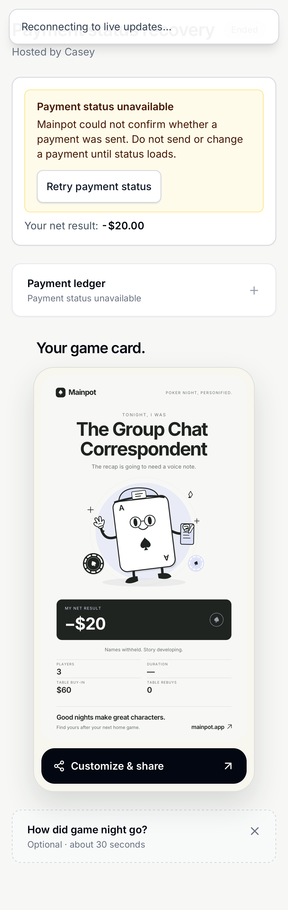
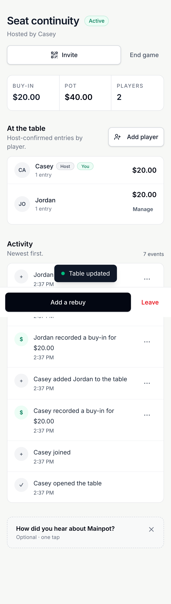
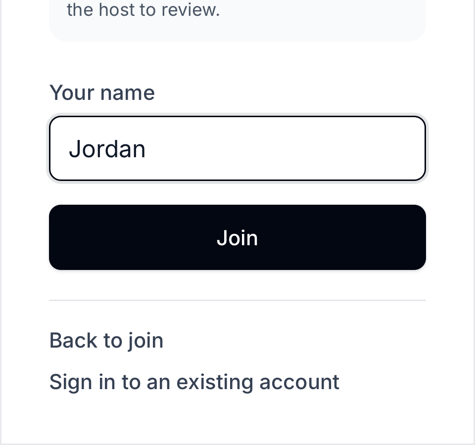

# Mainpot audit remediation — 26 September 2026

This follows the [full application audit](../REPORT.md). Changes are implemented in the local checkout; production deployment and production migrations are separate release work. Existing records are preserved.

## Changes and acceptance criteria

| Finding | Change | Required verification |
|---|---|---|
| F01 Payment read failures look unpaid | One shared payment-status read distinguishes loading, known, unavailable and stale. Failed refresh retains last known records; failed initial read never invents unpaid debt. Payment actions require confirmed reads. Local corrupt/inaccessible records also fail visibly. | Record two payments, fail reads, refresh/reload, retry reads without another payment write; payer and recipient views. |
| F02 Local saves fail silently | Failed ledger writes throw before snapshot/success is published. Invalid or inaccessible saved ledgers are preserved instead of being replaced by an empty ledger. | Inject quota failure, verify unchanged seats/pot, restore storage, retry and reload with one durable entry. |
| F03 Missing final stack | Existing local calculator correction retained. | Existing calculator validation regressions. Production remains unreleased. |
| F04 Release drift | Documented release boundary; local commits are not production evidence. | Deploy reviewed changes and migrations, then independently verify production. |
| F05/F06 Direct-link join clipping and no exit | Viewport-bounded scrolling, safe-area padding, Back to join, Escape exit, and existing-account sign-in return route. | 568×320 and 320×300 heading/amount/action reachability and exits; no duplicate seat. |
| F07 Misleading local invites | Browser-only games explain host-managed participation instead of showing a nonfunctional remote invite QR. | Existing local host workflow plus invite presentation. Connected invites remain shareable. |
| F08 Duplicate seats / managed-seat continuity | Per-game name reservations protect local and database paths, including concurrent joins, host-added seats and departed seats. NFKC normalization, case, collapsed whitespace and common invisible formatting identify collisions. Authenticated ownership alone permits ordinary resume. Host-issued capabilities allow safe managed-seat takeover without a second opening entry. | Direct writes, simultaneous joins, Unicode variants, copied-session denial, token expiry/replay/authorization, and host/player browser continuity. |
| F09 No safe return | Host can return an eligible departed player to the same active seat, preserving entries. Pending/locked early cash-outs and capacity prevent unsafe returns. Player sees ask-host guidance. The settle-later click invokes departure without passing a browser click event as a host-transfer ID. | Host-only restore, idempotent retry, phase/cash-out/capacity rejection, browser leave/return journey. |
| F10 Sign-in contrast | Separator text darkened from gray-400 to gray-600. | Browser render and computed contrast. |
| S02 Raw seat-write bypass (found during integration) | Direct authenticated seat creation is restricted to guarded RPCs. Seat deletion is limited to an active host removing a non-host seat; guests cannot erase their ledger via a cascading self-delete. Local removal mirrors the host-only guard. | Guarded creation/join/managed-add positive cases; deny raw inserts and guest/outsider deletes; preserve verified entries; permit host non-host removal; deny host self-deletion. |
| S01 Financial write/audit split | Buy-in creation, approval, removal and advance repayment include activity writes in the database transaction. A narrow compatibility guard ignores exact duplicate buy-in-added activity from older cached clients after a new server-side write. Idempotent retries avoid duplicate entries/events. | Inject activity failure and verify financial rollback; unauthorized action rejection and retry event counts. |

## Name uniqueness scope

A name identifies a seat within one game, including the host, phone-free managed players and departed players. Other games can reuse the same name. A matching display name or copied browser session never grants another account's seat. Existing legacy duplicate rows are grandfathered without rewriting financial history; the migration blocks additional collisions. This is normalized-name uniqueness, not a guarantee against every visually similar Unicode spelling.

## Verification

The final implementation is committed locally as `6cf2c6e`, with preceding scoped fix commits. The verification manifest records the revision for each final check.

- Unit tests: **179 passed** across 29 files; TypeScript and ESLint passed.
- Focused connected regressions: **15 passed** across desktop Chrome, Pixel 5 Chrome, iPhone 13 WebKit, desktop WebKit and iPad Mini WebKit. Separate browser contexts represent separate identities.
- Database assurance: **all 12 scripts passed** against a fresh disposable Supabase stack, including direct-write permission checks, concurrent joins, Unicode/invisible-name collisions, copied-session denial, legacy-row preservation, claim expiry/conflicts/replays, account deletion, host restoration and financial rollback. The full connected run completed with **129 passed and 6 test failures**: five old host-departure text assertions, plus one WebKit test navigating away before the Join form was ready. Those expectations/timing were corrected; **all 10 targeted reruns passed**, covering visitor privacy/exit and host handoff across the five profiles. This provides passing coverage of all 135 scenario/profile combinations across the full run and focused rerun, rather than a single clean full-run result.
- Local-mode suite: **97 passed, 3 skipped**. The three existing skips cover real service-worker behavior unavailable in WebKit; actual OS PWA behavior remains unverified.
- Final seat-write security verification: **all 12 database checks and 20 browser checks passed** after the permission hardening, covering visitor privacy, host transfer, concurrent duplicate-name rejection and managed-seat claim/return across all five profiles. A transaction-only legacy-policy probe reproduced the cascading guest self-delete and rolled it back before verifying the new restriction. The final accent-normalization refinement then passed focused database assurance and **all five duplicate-name browser checks**.

Browser checks use emulated devices, not physical phones. Native payment-app handoff, actual iOS/Android PWA installation, real OAuth/email recovery and live authenticated multiplayer remain outside this verification. Public production was audited without creating live games or modifying live financial records.

## Evidence

The screenshots below show the fixed states. The [original audit](../REPORT.md) preserves before-fix observations and production findings.

### Payment read failure remains unknown

### Returning the original seat

### Join controls remain reachable on a short screen

## Release boundary

Migrations were applied only to the disposable test database; the regular developer database was left untouched. No push, CI run, hosted database migration or production deployment was performed for this remediation. F04 remains release work, and production still needs the calculator correction described by F03. Apply the reviewed migrations with the frontend release, then verify the exact live flows with controlled identities. Existing duplicate beta seats are preserved and require a separate host-reviewed decision; the guard prevents new collisions without merging or deleting ledgers.
