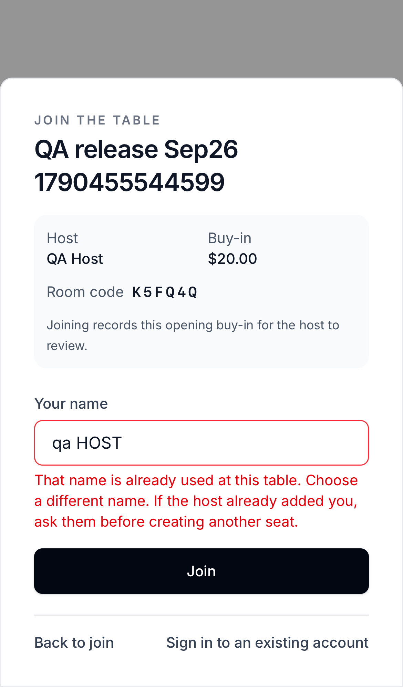
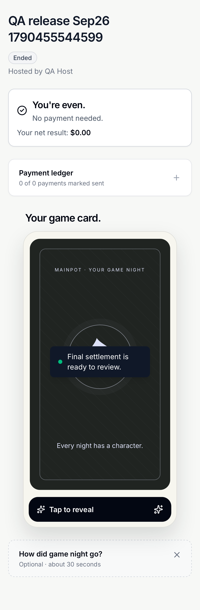
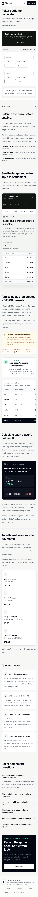

# Mainpot production release — 26 September 2026

The application audit fixes and preceding local improvements have been released to [mainpot.app](https://mainpot.app). This record separates source, database deployment, CI and actual production checks. The [original audit](../audits/2026-09-26/full-pass/REPORT.md) and [remediation report](../audits/2026-09-26/full-pass/fixes/REMEDIATION.md) remain historical snapshots.

## Source and deployment

The 85 scoped local commits through `d03c83d` were pushed to `main`, preserving the commit references used in the audit. They cover PWA recovery, dashboard continuity, settlement plans, lifecycle and phase guards, account transfer, idempotent creation, payment authority, display-name reservations, managed-seat claiming, return-to-seat, persistence failures, responsive entry flows, and their tests/evidence.

Vercel deployment `dpl_8irPurcaQNrPh9qGSGeQweFinF3c` reported **Ready**, with `mainpot.app` and `www.mainpot.app` assigned to the `d03c83d` build. GitHub [run 36269766963](https://github.com/AnuragGowda/mainpot/actions/runs/36269766963) passed all four jobs: lint/unit/browser smoke, realtime, database assurance and mobile smoke.

The additional production permission hardening is committed separately as `e4416da`. It changes database permissions and assurance coverage; the frontend application files are unchanged. The final Git/deployment receipt records the subsequent documentation-inclusive source revision.

## Database deployment and preservation

**25 required migrations were applied to the production Mainpot project.** Its history now matches all **50 canonical repository migration versions**, ending at `20260926203813_restrict_hosted_function_defaults`.

Earlier deployment history contained three timestamp aliases, one combined five-file migration, and several applied-but-unrecorded baseline changes. Three alias SQL bodies and all five combined source bodies matched the repository after removing comments/whitespace; baseline catalog checks verified the remaining installed or superseded protections. History was reconciled without rerunning the old cleanup/backfill statements. The original combined/alias records are retained locally in `.git/production-migration-history-legacy-20260926.json`.

Before and after the migrations, fingerprints of existing game fields, player identities, buy-ins, cash-outs and activity rows were unchanged. Existing counts were 12 games, 46 players, 58 buy-ins, 43 cash-outs and 308 activity events. Synthetic production QA games and their anonymous accounts were removed after verification. The ordinary developer database was not reset or migrated.

Per-game normalized display-name uniqueness is live, including host-added and departed seats. Existing legacy duplicates were preserved without merging financial histories. The protection blocks new normalized duplicates; it does not identify every visually similar Unicode spelling.

## Additional production finding: hosted function grants

The production advisor exposed **S03: maintenance RPC permissions inherited from hosted defaults**. Supabase's explicit `anon`/`authenticated` grants meant an earlier `REVOKE FROM PUBLIC` did not actually deny the cleanup function to API roles. The scheduled cleanup function was not invoked to demonstrate the finding.

The new migration removes unauthenticated execution of Mainpot security-definer functions, prevents browser execution of trigger and maintenance functions, preserves guarded authenticated user RPCs, and grants maintenance to `service_role`. It also removes implicit future function grants. PostgreSQL requires a global default revoke to remove the default `PUBLIC` function grant; a schema-only revoke cannot counter a global grant. See [PostgreSQL default privileges](https://www.postgresql.org/docs/current/sql-alterdefaultprivileges.html).

Production read-back confirmed:

- `anon` and `authenticated` cannot execute the cleanup RPC.
- `service_role` retains maintenance access; the postgres-owned hourly schedule remains enabled.
- No non-extension public security-definer function is executable by `anon`.
- Authenticated browser roles cannot execute public trigger functions directly.
- A real production guest API request to cleanup returned **403**, as did a raw fake-host seat insertion.

The guard passed **all 13 isolated database assurance scripts** and **10 browser regressions across five profiles**, including normal guest entries/approval and managed-seat claim/return. The privilege test simulates explicit hosted grants, repairs them in a rolled-back transaction, and proves future function defaults. No production cleanup operation was run.

## Live verification

A final clean smoke run used independent desktop Chromium host and iPhone-profile WebKit guest contexts against the production domain:

1. Create a shared game with exactly one host opening entry.
2. Reject the existing host name despite case/spacing changes.
3. Join with another name; synchronize roster and approve the pending entry.
4. Deny raw fake-host creation and guest maintenance execution through the production API.
5. Reload the guest and resume the same seat without another opening entry.
6. Enter both final stacks, reconcile, lock settlement, synchronize the guest, and reload the finalized result.

The final run passed without uncaught page errors. Earlier smoke-script attempts were corrected for a single-entry **Approve** control and intentionally collapsed settlement details; they did not establish application defects. Fixtures were removed after the checks.

A public sweep covered five routes (`/`, `/create`, `/join`, `/signin`, calculator) across six profiles: desktop Chromium, Pixel 5, iPhone WebKit, iPad WebKit, desktop WebKit and 320px Chromium. **All 30 checks completed**, with no page errors, document overflow or automated accessibility findings in that scope. The live calculator now blocks results when a final stack is missing instead of producing payment instructions.

Local release gates passed: **179 unit tests**, TypeScript, ESLint and production build. Broader local cross-device evidence remains in the remediation report, including the 97-pass/3-skip local suite and the explicitly documented connected full-run/rerun results.

### Duplicate names are rejected on production

### Final settlement survives reload

### Missing calculator input stays incomplete

## Workspace cleanup

All 12 remaining non-primary worktree directories were clean and removed; a stale missing worktree registration was pruned. The 16 non-main local branches were removed. Their tips are preserved in `.git/mainpot-worktree-cleanup-20260926.bundle`, including the older host-setup patch whose behavior was incorporated into a broader main commit. Only the primary checkout and local `main` remain. The integrated remote telemetry branch was removed; the two open Dependabot PR branches were preserved.

## Current standing and next audit

My assessment is **7/10 for a controlled beta**. This is a judgment based on the evidence, not a certification. The host/joining/ledger/settlement paths now have strong local regression coverage and a real hosted smoke check. Production migrations, deployed code and local source are aligned, and the newly found hosted permission gap is closed.

An independent audit is warranted before expanding the beta. Use a fresh reviewer against this deployed revision, with synthetic identities and an isolated environment for destructive fault injection. Prioritize host/player/outsider authorization, concurrent joins and financial writes, recovery after failed writes/reconnect, account/email recovery, early exits and settlement/payment transitions. Include actual iPhone/Android PWA and native payment-app behavior, then a longer multiplayer soak and restoration/alert checks.

Remaining limits are real: emulation is not physical-device testing; email/OAuth delivery and account recovery were not accepted end-to-end on production; native payment handoff, backup restoration, alert delivery and extended load were not verified. The production advisor also reports [leaked-password protection disabled](https://supabase.com/docs/guides/auth/password-security#password-strength-and-leaked-password-protection). The remaining authenticated-definer/guest-policy notices include intended guarded guest workflows, and deny-all RLS notices include internal tables; they still deserve independent review, rather than being presented as a clean security certification.
