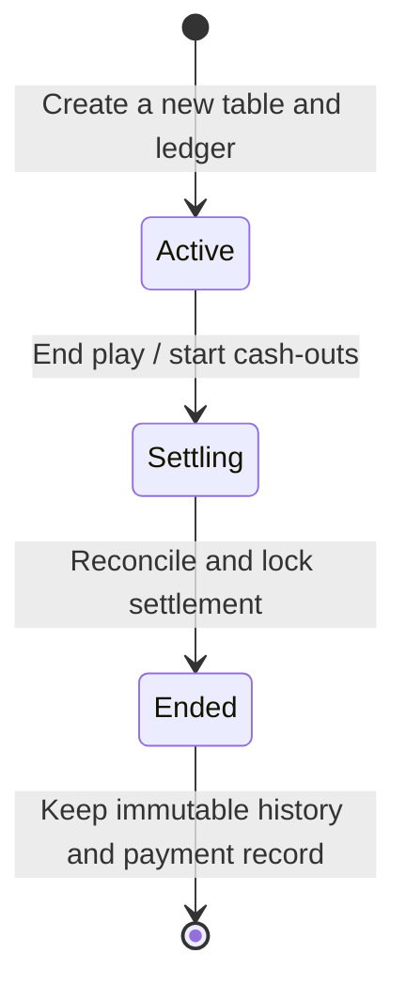
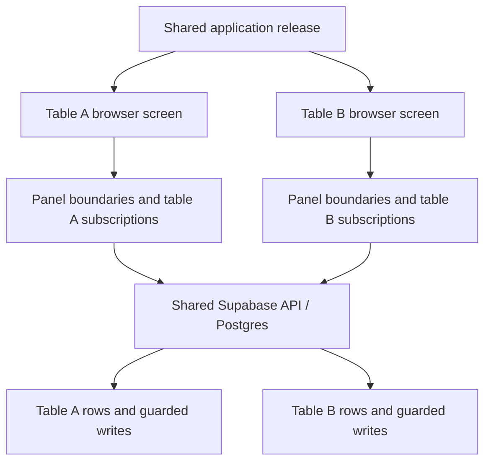

# Mainpot lifecycle and failure-isolation review

This is a bounded review prompted by the September 26 room crash and September
27 restart feedback. It is not certification of the whole application.

## The lifecycle the interface must communicate

“End game” closes play, not the money record. `settling` means cash-outs still
need completing; `ended` means the final plan is locked. Payment confirmations
can continue against that locked plan. A fresh table always receives a new ID
and ledger. Never reset a saved table to active to implement “play again.”

The restart action belongs near the settlement heading at every stage. An
unfinished settlement must remain recoverable with “Finish cash-outs,” while
an ended game must not be advertised as active or written back to the resume
list when its history is opened. Guest accounts currently allow two unfinished
tables, including settlements; starting a third requires finishing one or
signing in. This guard must be explained rather than silently discarding debt.

## Findings addressed in this change

- The restart action existed only deep in the finalized payment record. A
  prominent “Start another table” now opens prefilled setup during cash-outs,
  review, and finalized results, preserving the prior ledger.
- Room loading wrote even ended rooms into active-device storage. Ended rooms
  now remove only their own code, including when finalization arrives live.
- Landing and create resume cards read only on mount. They now revalidate on
  focus, visibility return, browser history restoration, storage changes, and a
  periodic visible-page refresh. Failed requests do not delete saved codes.
- Settling cards misleadingly used “Resume game.” They now explain that play
  ended and offer “Finish cash-outs.”
- Finalized cards required a tap and reveal animation. The card and editor
  preview now render directly; sharing still requires an explicit action.
- Early-cash-out, activity, and optional recap render failures now have panel
  boundaries. A new game mounts fresh room state and boundaries keyed by code.
  The route-level fallback also offers a full document exit to table setup.

## What is isolated, and what is shared

A JavaScript render exception does not by itself stop another phone's browser
or the database. Boundaries contain render/lifecycle errors; asynchronous
requests and event handlers still require explicit catches. Realtime setup
and cleanup are contained separately, with authoritative polling kept alive.
See [React's error boundary documentation](https://react.dev/reference/react/Component#catching-rendering-errors-with-an-error-boundary).

Database row policies and game-scoped guarded RPCs provide access isolation.
They do not isolate availability or guarantee a bad request cannot consume
shared resources. Existing database-assurance scripts include cross-game and
outsider rejection probes. See [Supabase RLS documentation](https://supabase.com/docs/guides/database/postgres/row-level-security).

The following remain shared: the shipped JavaScript bundle, Vercel routing,
Supabase/Auth/Realtime, database capacity, and origin-wide app caches or auth
within one browser. A defective release can trigger the same bug independently
at multiple tables. A backend outage, auth failure, or resource exhaustion can
also affect multiple rooms. One database or server per home game would add
substantial operational complexity and is not justified by the confirmed
client subscription defect.

The September 26 second-table failure remains unclassified: we need whether it
occurred on another person's device, its game state, time, and support code.
Do not label it direct propagation from the first table without that evidence.

## Verification for this change

Database-backed regression tests exercise:

1. End play, start a second fresh table while the first is settling, preserve
   the first cash-outs, finalize it, see the recap immediately, and resume only
   the second table even with an older ended code in device storage.
2. Inject a display failure into only table A's activity responses. The rest of
   A remains visible. A separate table in the same browser identity and a third
   table under another identity keep writing, reloading, and retaining their
   separate balances. Recover A and switch rooms without inheriting its error.

Local passes, CI (including retries), deployment, production checks, and the
user's existing installed-app recovery must be reported separately.

Local validation on September 27 passed all 10 new database-backed regression
runs across five browser/device profiles and 15 existing settlement, sharing,
host-managed-player, and 320px journeys. The original two-cash-out regression
also passed its 10 runs on this application code. All 275 unit tests, lint,
the production build, and `git diff --check` passed. The isolation test waits
for in-flight interception handlers before removing them; it exempts only
WebKit's exact auth-request cancellation during an explicit reload, after
which each identity and distinct saved balance must restore. This does not
verify physical phones or explain the earlier second-table incident.

## The focused review to do next

| Area | Question to prove | Evidence required |
| --- | --- | --- |
| Lifecycle | Can guests and account owners finish, restart, split, and return without losing obligations? | Real multi-device scenarios for active, settling, ended, and departed seats |
| Money writes | Are duplicate retries harmless, and are closed ledgers immutable? | Guarded RPC/idempotency and concurrency tests |
| Isolation | Can any write target another game's player or payment? | RLS and cross-game RPC rejection probes |
| Failure recovery | Can auth, reconnects, stale app assets, and delayed responses recover safely? | Failure injection and physical installed-app checks |
| Shared capacity | Can a busy or abusive table exhaust shared database/Realtime resources? | Bounded request/rate-limit review and representative load test; not completed here |
| Operations | Do actual room errors alert us, and can we roll back and restore? | Alert delivery, exact-build rollback, backup-restore drill; not certified here |

Review the lifecycle and these invariants yourself as product owner. For the
money and authorization paths, an independent technical review is useful.
The outcome should be a small set of written guarantees, tests, and open risks,
not a speculative framework rewrite or a claim that unseen bugs are impossible.
